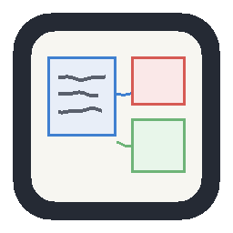

# Claude Notes Panel

When Claude is planning, comparing options, or walking you through a bug, it
usually has to write a wall of text. This extension gives it a whiteboard
instead.

Claude writes a small JSON spec to `.claude/notes.json`; the panel watches that
file and renders it live — as a hand-drawn board, a precise diagram, or a
mermaid graph. Nothing is left behind for you to clean up: the file is scratch,
overwritten on every board.



## Install

Install from the Marketplace, open a project where you use Claude Code, and run
**Claude Notes: Open Panel** (`Ctrl+Alt+N` / `Cmd+Alt+N`).

Then teach Claude to use it — copy `skill/SKILL.md` to either:

- `~/.claude/skills/visual-notes/SKILL.md` — every project, or
- `.claude/skills/visual-notes/SKILL.md` — this project only.

Claude Code picks it up automatically and will start drawing during planning
conversations instead of writing long prose.

## What you get

**Three styles over one board.** The hand-drawn style reads as
thinking-in-progress, which is right for a live discussion. Switch to **clean**
from the toolbar when you want to paste the same board into a ticket or a
design review — identical layout, precise strokes. **Mermaid** is there for the
formal graph types (sequence, state, ER, gantt).

**Frames, tables and screens.** Boards are not just boxes and arrows: Claude
can draw a labelled region, a record list with a specific row tinted red, or a
form view — so "the bug is on line 3887" can be *shown* rather than described.

**You can answer back.** Claude can leave questions on the board; you answer in
the panel. You can also draw on it with the pen and drop sticky notes. Anything
you leave is captured to `.claude/notes_feedback.json`, and VS Code offers to
copy it in a form you can paste straight back to Claude.

**A per-project library.** Boards worth keeping are archived to
`.claude/notes/`. When Claude replaces the live board with a differently-titled
one, the outgoing board is saved first, so nothing is silently lost. Commit
that directory if you want the history to travel with the repo, or gitignore it
if it is personal scratch.

## Keyboard

The panel is fully keyboard-operable, and the board exposes a text description
to screen readers.

| Key | Action |
|---|---|
| `Ctrl+Alt+N` / `Cmd+Alt+N` | Open the panel |
| `Tab` / `Shift+Tab` | Move through the toolbar; inside the board, between elements |
| Arrow keys | Pan |
| `+` / `-` | Zoom in / out |
| `0` | Reset zoom to 100% |
| `F` | Fit the board to the panel |
| `P` | Pen mode |
| `N` | Drop a sticky note |
| `Escape` | Close a tray, or leave pen/note mode |
| `Ctrl+Enter` | Submit the answer you are typing |

**Claude Notes: Copy Board as Text** puts the same description the screen
reader gets on your clipboard — useful for pasting a board into a ticket.

## Settings

| Setting | Default | |
|---|---|---|
| `claudeNotes.defaultStyle` | `sketchy` | Style for boards that do not declare one |
| `claudeNotes.openOnStartup` | `true` | Open automatically when a board already exists |
| `claudeNotes.notifyOnFeedback` | `true` | Tell you when a reply is captured |
| `claudeNotes.feedback.maxEntries` | `500` | Bound on the feedback log |
| `claudeNotes.library.maxEntries` | `200` | Bound on the board library |
| `claudeNotes.reducedMotion` | `auto` | `auto` follows VS Code's `workbench.reduceMotion` |

## Good to know

**The channel to Claude is one-way.** Anything you leave in the panel sits in
`.claude/notes_feedback.json` until Claude is next invoked — there is no live
socket. The notification's **Copy for Claude** action is the fastest way to
hand it over; otherwise just tell Claude to check the board.

**Theming and contrast.** Every colour comes from your theme's own tokens, and
the palette is checked against WCAG AA for all seven semantic kinds across
dark, light and both high-contrast themes. Kinds are also distinguished by
stroke pattern, not only hue, so they stay readable in high contrast and for
colour-vision differences.

**It watches the first workspace folder.** In a multi-root workspace the status
bar names which one.

**Restricted workspaces.** In a workspace you have not trusted, the panel
renders read-only: it will not write to `.claude/`, save to the library, or run
mermaid.

## Developing

Requires **Node 22+** (`@vscode/vsce` 4 needs it).

```bash
npm install
npm run compile      # check-types + lint + esbuild (two bundles)
npm run test:unit    # fast, no DOM, no VS Code
npm test             # integration, drives a real VS Code
npm run package      # -> .vsix
```

Press `F5` to launch an Extension Development Host.

The layout engine is a pure function — `layout(spec, measurer) → LayoutResult`
— with no DOM, no theme and no rough.js, so all three renderers and the
accessibility description are drawn from one geometry. Text measurement is
injected, which is what lets layout be tested with no DOM at all. (Do not
reach for jsdom here: it has no `getBBox`, and happy-dom returns zeros, which
silently produces a board where everything sits at the origin.)

## License

MIT
